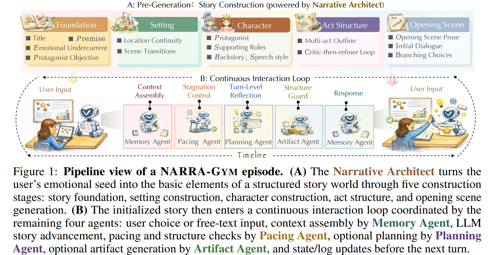
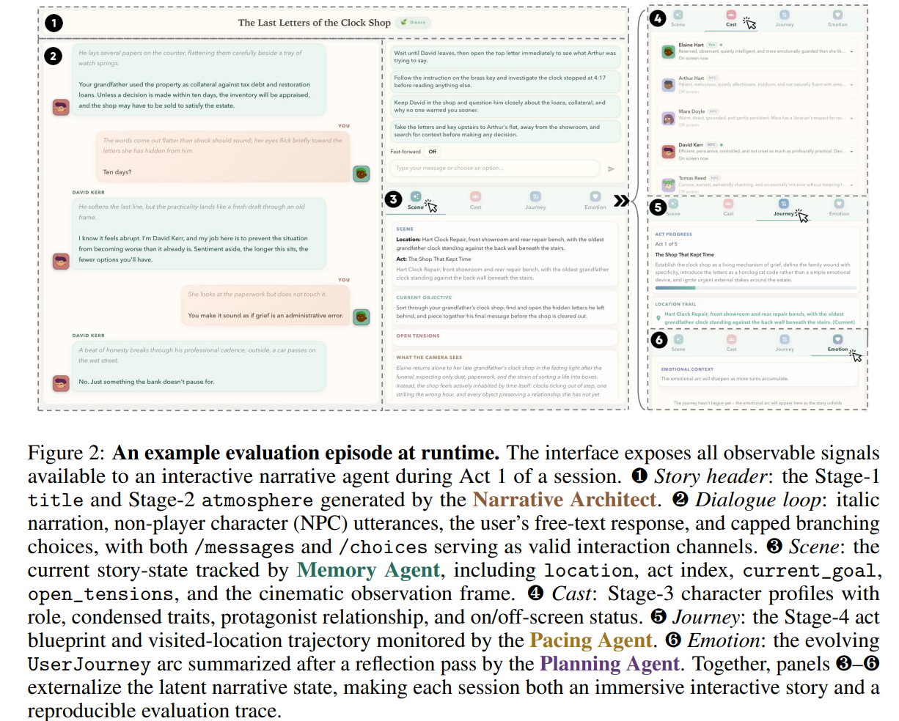
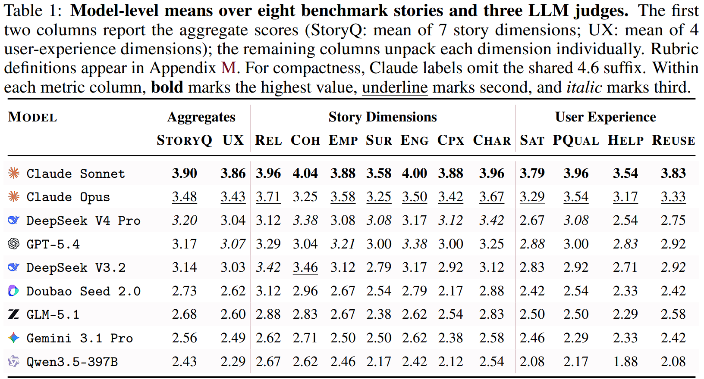
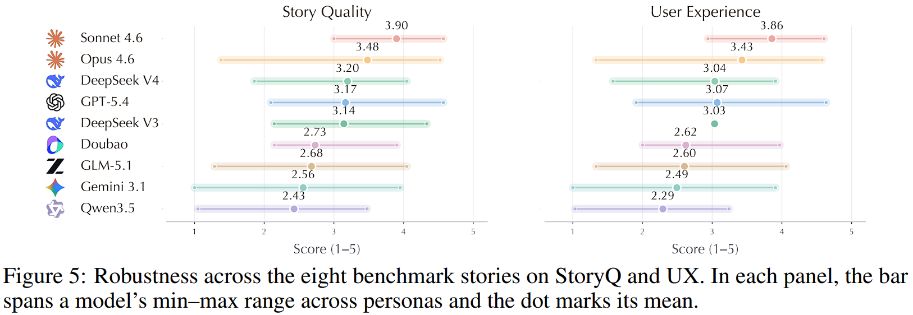

<h1 align="center">NARRA-Gym</h1>
<h3 align="center">Evaluating Narrative Agents</h3>

<p align="center">
  
  
  
  
  <br/>
  
  
  
</p>

<p align="center">
  <a href="#overview">Overview</a> •
  <a href="#architecture">Architecture</a> •
  <a href="#interface">Interface</a> •
  <a href="#quick-start">Quick Start</a> •
  <a href="#benchmark">Benchmark</a> •
  <a href="#results">Results</a>
</p>

---

## Overview

Most LLM benchmarks ask a model to *answer*. **NARRA-Gym** asks it to **stay**.

NARRA-Gym is an executable evaluation environment for testing LLMs as **interactive narrative agents** along five coupled dimensions: creative story generation, long-context state tracking, character simulation, empathic personalization, and story-grounded interactive artifact generation. Inside a live interaction loop, the environment orchestrates five-stage story construction, multi-resolution narrative memory, reflection-guided planning, anti-stagnation control, novelty-constrained artifact synthesis, and fail-soft structured generation — turning interactive storytelling from a loosely specified demo into a *reproducible Gym* for studying persistent, emotionally aware, story-driven language agents.

The repo ships both:

- the **engine** — a working app users (or simulated users) can talk to
- the **gym around it** — persona-faithful simulated users + LLM-as-judge benchmark harness

---

## Architecture

<p align="center">
  
</p>


### The Three Fives

NARRA-Gym is built around three orthogonal "fives" — what we *test*, *who* runs each turn, and *how* a story comes into being.

#### Five Capabilities — what we ask a model to hold

| # | Capability | What it tests |
|---|---|---|
| i | **Creative Story Generation** | Build a multi-stage narrative from sparse emotional input — fluent, novel, dramatically structured. |
| ii | **Long-Context Management** | Preserve consistency across turns: tensions, clues, transitions, user decisions remain actionable. |
| iii | **Character Simulation** | Stay in voice, in role, and in motive — across many turns, without breaking. |
| iv | **Empathic Personalization** | Adapt to the user's emotional context without becoming a therapy chatbot. |
| v | **Interactive Artifact Generation** | Render story-grounded objects (letters, maps, ciphers, dials) the reader can touch. |

#### Five Agent Roles — the ensemble that runs each turn

| # | Agent | Duty |
|---|---|---|
| I | **Narrative Architect** | Builds a whole world from sparse emotional input — premise, setting, cast, act structure, opening scene. |
| II | **Memory Agent** | Maintains three temporal resolutions of the story: the verbatim now, rolling summaries, and the latent state that lasts forever. |
| III | **Pacing Agent** | Detects eloquent stalling. Escalates from gentle nudge to mandatory shift when the plot is only pretending to move. |
| IV | **Planning Agent** | Per-turn reflection: unresolved tensions, user interests, pacing, and where the story ought to go next. |
| V | **Artifact Agent** | Shapes story state into letters, maps, ciphers, dials — with tag-based novelty filtering so it never repeats itself. |

#### Five-Stage Lifecycle — from feeling to opening scene

```
Foundation  →  Setting  →  Characters  →  Act Structure  →  Opening Scene
```

Every story is built through a logged five-stage pipeline before a single turn is taken, so researchers can pinpoint exactly where things bloomed — or wilted. **Act Structure** runs through a critic-then-refiner loop with fail-soft fallbacks.

---

## Interface

<p align="center">
  
</p>


---

## Quick Start

### Prerequisites

| Tool | Version |
|------|---------|
| Python | ≥ 3.9 (3.10+ recommended) |
| Node.js | ≥ 18 LTS |
| npm | ≥ 9 |

You will need at least one LLM API key — [OpenAI](https://platform.openai.com/api-keys) or [OpenRouter](https://openrouter.ai/keys). Optional: [Gemini](https://aistudio.google.com/apikey) for image generation, [Remove.bg](https://www.remove.bg/api) or [Replicate](https://replicate.com/account/api-tokens) for background removal.

### 1. Install

```bash
# Backend
conda create -n narragym python=3.10 -y && conda activate narragym
pip install -r requirements.txt

# Frontend
cd frontend && npm install && cd ..
```

### 2. Configure

```bash
cp backend/.env.example backend/.env
# Edit backend/.env. Minimum required:
#   LLM_PROVIDER=openai
#   LLM_API_KEY=sk-...
#   LLM_STORY_MODEL=gpt-4o-mini
```

### 3. Launch

```bash
bash run_app.sh        # macOS / Linux
python run_app.py      # cross-platform
```

| Service | URL |
|---------|-----|
| Frontend | http://localhost:3000 |
| Backend API | http://localhost:11454 |
| API docs (Swagger) | http://localhost:11454/docs |

---

## Benchmark

The `simulation/` harness drives the live backend with **persona-faithful simulated users** (LLM #1) and scores each session with an **independent judge** (LLM #2), using the same 11-dimension rubric as the human evaluation.

```bash
# 1. Make sure the backend is running.
bash run_app.sh

# 2. Smoke test — single persona, single run, verbose.
python -m simulation.runner --persona burnt_out_engineer --runs 1 --verbose

# 3. Full sweep — every persona, 3 runs each.
python -m simulation.runner --runs 3

# 4. A/B different SUT models.
python -m simulation.runner --sut-model openai/gpt-5.4      --runs 5 --out-dir simulation/results/condA
python -m simulation.runner --sut-model openai/gpt-5.4-mini --runs 5 --out-dir simulation/results/condB
```

Each run emits one JSON line to `simulation/results/sim_runs_*.jsonl` with the full transcript, all judge scores, and timing.

> ⚠️ **Always pair `SIM_USER_MODEL` and `JUDGE_MODEL` from different model families.** Same family = self-preference bias = inflated scores.

---

## Results






---

## Repo Layout

```
NARRA-Gym/
├── backend/                    # FastAPI engine — the live story server
│   └── src/
│       ├── main.py                   # API + 5-stage lifecycle (Architect)
│       ├── context_manager.py        # rolling summaries + journey (Memory)
│       ├── story_advancement.py      # per-turn engine + stagnation (Pacing)
│       ├── meta_planner.py           # reflection + interactive HTML (Planner + Artifact)
│       ├── prompt_templates.py
│       ├── llm_client.py
│       ├── experiment_store.py
│       └── ...
├── frontend/                   # React + TypeScript SPA
├── simulation/                 # benchmark harness
│   ├── personas/                     # YAML personas
│   ├── simulated_user.py             # persona-faithful user agent (LLM #1)
│   ├── judge.py                      # LLM-as-judge (LLM #2)
│   └── runner.py                     # orchestrator + CLI
├── benchmark_website/          # public landing page
├── scripts/                    # report generation
├── output/                     # benchmark scores + comparison reports
├── figures/                    # architecture, interface, results, robustness
├── run_app.{sh,py}             # one-command launchers
└── requirements.txt
```

---

## Configuration Reference

The complete environment-variable list lives in [`backend/.env.example`](backend/.env.example). Key groups:

| Group | Variables |
|---|---|
| Provider routing | `LLM_PROVIDER`, `LLM_API_KEY`, `LLM_BASE_URL` |
| Per-task models | `LLM_DEFAULT_MODEL`, `LLM_STORY_MODEL`, `LLM_INTERACTIVE_ELEMENT_MODEL`, `LLM_QUESTIONS_MODEL`, `LLM_KEYWORDS_MODEL`, `LLM_PROFILE_KEYWORDS_MODEL`, `LLM_REFLECTION_MODEL` |
| Image / background | `IMAGE_API_PROVIDER`, `GEMINI_API_KEY`, `BG_REMOVAL_PROVIDER`, `REMOVEBG_API_KEY`, `REPLICATE_API_TOKEN` |
| Network | `HTTP_PROXY`, `HTTPS_PROXY` |
| Persistence | `EXPERIMENT_DB_PATH`, `EXPORT_OUTPUT_DIR` |
| Benchmark (sim) | `SIM_USER_MODEL`, `SIM_USER_TEMPERATURE`, `JUDGE_MODEL`, `JUDGE_TEMPERATURE`, `SUT_BASE_URL` |

Models that reject a `temperature` parameter can be listed in `LLM_TEMPERATURELESS_MODELS` (comma-separated).
